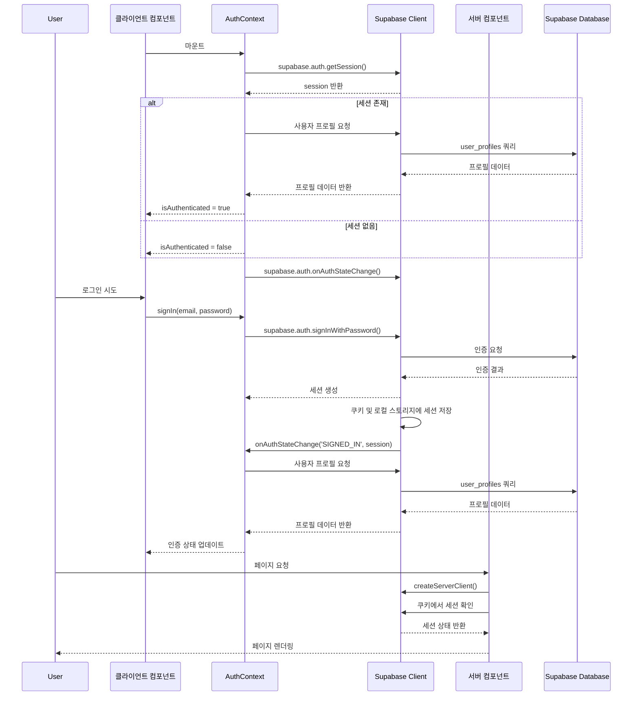
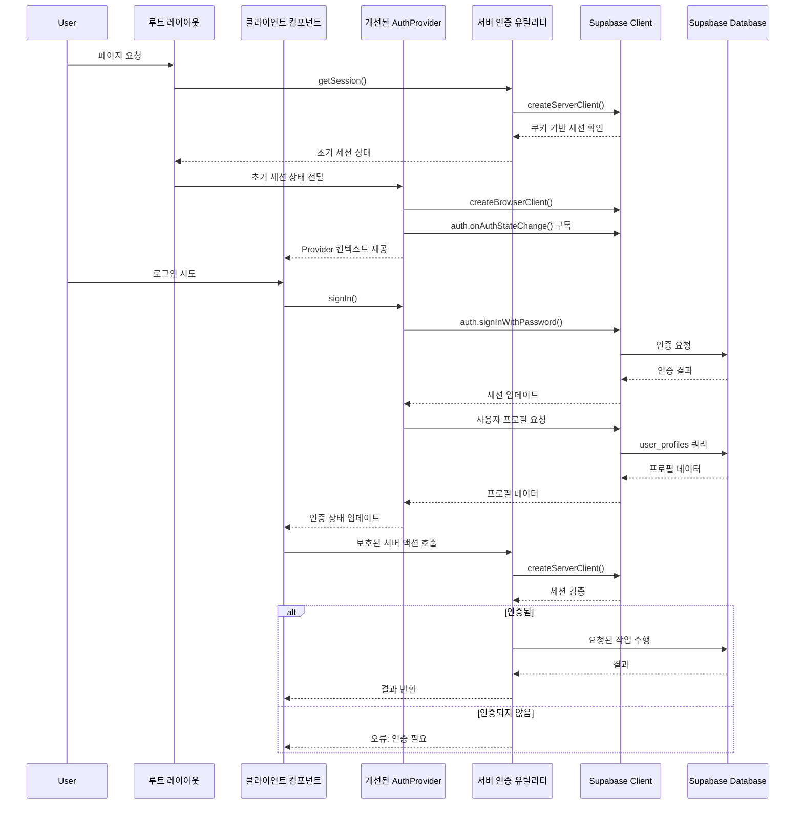

# Supabase 인증 흐름 다이어그램 및 개선 방안

## 현재 인증 흐름 다이어그램



## 현재 인증 흐름의 문제점

1. **클라이언트/서버 코드 혼합**: AuthContext는 클라이언트에서만 작동하지만, 페이지 렌더링 전에 서버에서 인증을 확인할 수 있는 명확한 패턴이 없습니다.

2. **중복된 상태 관리**: AuthContext와 SupabaseProvider가 각각 인증 상태를 관리하며, 이들 사이의 관계가 불분명합니다.

3. **다중 저장소 사용**: 인증 상태를 로컬 스토리지와 쿠키에 모두 저장하여 불필요한 중복과 잠재적 불일치가 발생할 수 있습니다.

4. **서버 컴포넌트 인증**: 서버 컴포넌트에서 인증을 처리하는 일관된 패턴이 없어 보안 취약점이 발생할 수 있습니다.

## 개선된 인증 흐름 다이어그램



## 개선 권장사항

### 1. 서버/클라이언트 인증 분리

```typescript
// lib/supabase/server.ts
import { createServerClient } from '@supabase/ssr';
import { cookies } from 'next/headers';

export async function createServerSupabaseClient() {
  const cookieStore = cookies();
  return createServerClient(
    process.env.NEXT_PUBLIC_SUPABASE_URL!,
    process.env.NEXT_PUBLIC_SUPABASE_ANON_KEY!,
    {
      cookies: {
        get(name) {
          return cookieStore.get(name)?.value;
        },
        set(name, value, options) {
          cookieStore.set({ name, value, ...options });
        },
        remove(name, options) {
          cookieStore.set({ name, value: '', ...options });
        },
      },
    }
  );
}

// 서버 측 인증 상태 확인
export async function getServerSession() {
  const supabase = await createServerSupabaseClient();
  return supabase.auth.getSession();
}
```

### 2. 통합된 인증 컨텍스트 제공자

```typescript
// lib/supabase/auth-provider.tsx
'use client';

import React, { createContext, useContext, useState, useEffect } from 'react';
import { User, Session } from '@supabase/supabase-js';
import { createBrowserSupabaseClient } from './client';

type AuthContextType = {
  user: User | null;
  session: Session | null;
  isLoading: boolean;
  signIn: (email: string, password: string) => Promise<void>;
  signOut: () => Promise<void>;
  // ... 기타 필요한 메서드
};

const AuthContext = createContext<AuthContextType | undefined>(undefined);

export function AuthProvider({
  children,
  initialSession,
}: {
  children: React.ReactNode;
  initialSession?: Session | null;
}) {
  const [supabase] = useState(() => createBrowserSupabaseClient());
  const [session, setSession] = useState<Session | null>(initialSession || null);
  const [user, setUser] = useState<User | null>(initialSession?.user || null);
  const [isLoading, setIsLoading] = useState(true);

  useEffect(() => {
    const { data: { subscription } } = supabase.auth.onAuthStateChange(
      (_event, newSession) => {
        setSession(newSession);
        setUser(newSession?.user || null);
        setIsLoading(false);
      }
    );

    return () => subscription.unsubscribe();
  }, [supabase]);

  const signIn = async (email: string, password: string) => {
    setIsLoading(true);
    await supabase.auth.signInWithPassword({ email, password });
  };

  const signOut = async () => {
    await supabase.auth.signOut();
  };

  return (
    <AuthContext.Provider value={{ user, session, isLoading, signIn, signOut }}>
      {children}
    </AuthContext.Provider>
  );
}

export function useAuth() {
  const context = useContext(AuthContext);
  if (context === undefined) {
    throw new Error('useAuth must be used within an AuthProvider');
  }
  return context;
}
```

### 3. 루트 레이아웃에서 통합

```typescript
// app/layout.tsx
import { AuthProvider } from '@/lib/supabase/auth-provider';
import { getServerSession } from '@/lib/supabase/server';

export default async function RootLayout({
  children,
}: {
  children: React.ReactNode;
}) {
  const { data: { session } } = await getServerSession();

  return (
    <html lang="ko">
      <body>
        <AuthProvider initialSession={session}>
          {children}
        </AuthProvider>
      </body>
    </html>
  );
}
```

### 4. 서버 액션에서 인증 확인

```typescript
// lib/supabase/server-actions.ts
import { createServerSupabaseClient } from './server';

// 보호된 서버 액션 래퍼
export async function withAuth<T>(
  callback: (userId: string) => Promise<T>
): Promise<T> {
  const supabase = await createServerSupabaseClient();
  const { data: { session } } = await supabase.auth.getSession();
  
  if (!session) {
    throw new Error('인증이 필요합니다');
  }
  
  return callback(session.user.id);
}

// 사용 예시
export async function updateUserProfile(formData: FormData) {
  return withAuth(async (userId) => {
    const supabase = await createServerSupabaseClient();
    const { data, error } = await supabase
      .from('user_profiles')
      .update({ /* 프로필 데이터 */ })
      .eq('id', userId);
      
    if (error) throw new Error('프로필 업데이트 실패');
    return data;
  });
}
```

## 이점

1. **명확한 책임 분리**: 서버와 클라이언트의 인증 로직이 명확히 구분됩니다.
2. **일관된 인증 체계**: 동일한 인증 상태를 서버와 클라이언트 양쪽에서 접근할 수 있습니다.
3. **보안 강화**: 서버 측에서 세션을 검증하여 민감한 작업을 보호합니다.
4. **단순화된 API**: 개발자가 사용하기 쉬운 통합된 인증 API를 제공합니다.
5. **성능 최적화**: 서버에서 초기 세션을 미리 가져와 클라이언트에 제공하여 추가 요청을 줄입니다.

## 결론

위에서 제안된 개선 사항은 Next.js의 App Router와 Supabase의 SSR 기능을 활용하여 보다 구조화되고 안전한 인증 시스템을 구축하는 방향을 제시합니다. 이 구조는 서버 컴포넌트와 클라이언트 컴포넌트 간의 명확한 경계를 설정하고, 각각의 환경에 최적화된 인증 방식을 사용함으로써 성능과 보안을 모두 향상시킵니다. 